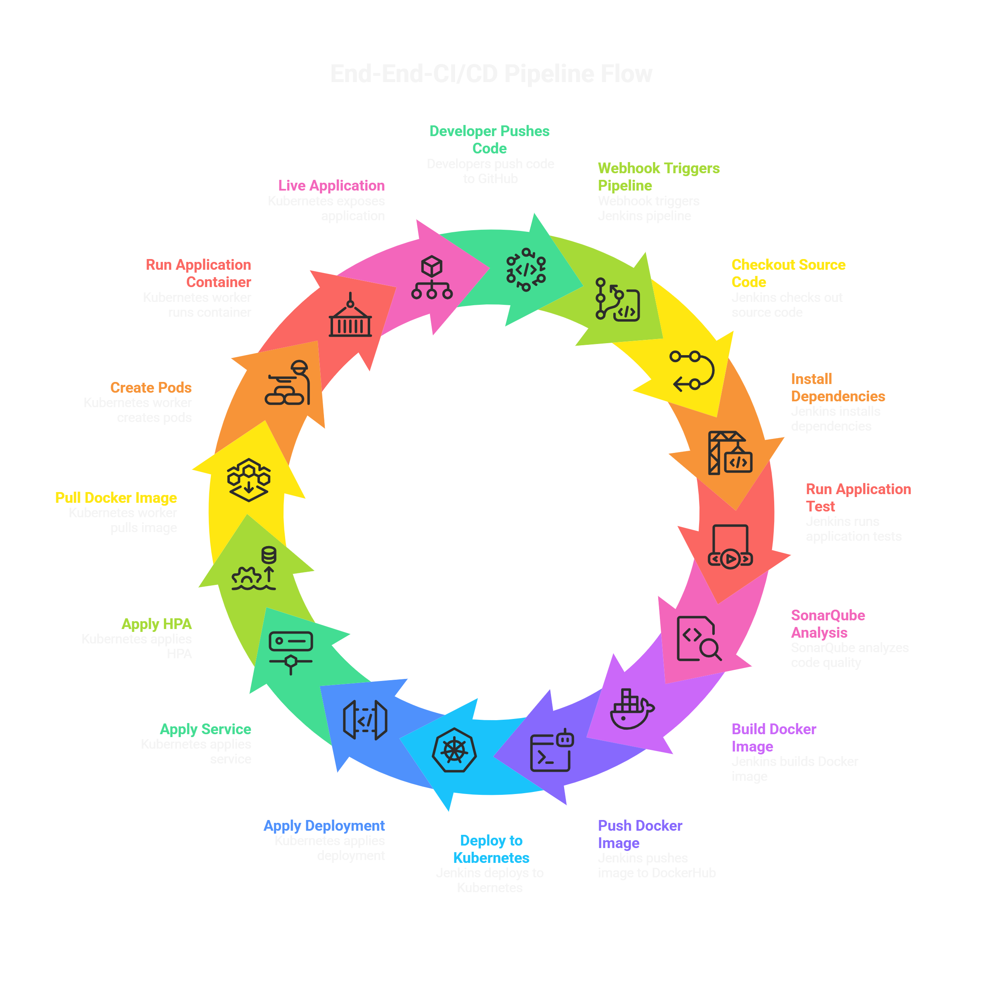

# End-to-End Cloud-Native CI/CD Pipeline with Monitoring

## Project Overview

This project demonstrates a complete **Cloud-Native CI/CD pipeline** that automates the full software delivery lifecycle from **developer code commit to live Kubernetes deployment**. It integrates modern DevOps tools to build, test, analyze, containerize, deploy, scale, and monitor an application in a production-style environment.

The pipeline is designed to simulate a real-world DevOps workflow where every code change pushed by a developer is automatically processed through a **CI/CD** system and deployed to a **Kubernetes cluster** with observability enabled through **Prometheus** and **Grafana**.

## Architecture diagram


## Architecture flow 
The complete **Cloud-Native CI/CD pipeline** that automates the full software delivery




## Project Structure
```
end-to-end-cloud-native-cicd-pipeline
    │
    ├── app
    │ ├── public
    │ │ ├── index.html
    │ │ ├── script.js
    │ │ └── style.css
    │ │
    │ ├── db.js
    │ ├── server.js
    │ ├── package.json
    │ └── Dockerfile
    │
    ├── k8s
    │ ├── deployment.yaml
    │ ├── service.yaml
    │ └── hpa.yaml
    │
    ├── monitoring
    │ ├── prometheus.yml
    │ ├── grafana-datasource.yaml
    │ └── grafana-dashboard.json
    │
    ├── architecture
    │
    ├── screenshots
    │
    ├── Jenkinsfile
    ├── sonar-project.properties
    ├── .hintrc
    └── README.md
```

---

## Technology Stack

| Tool | Purpose |
|------|---------|
| GitHub | Source code repository |
| Jenkins | CI/CD automation server |
| SonarQube | Code quality and security analysis |
| Docker | Containerization |
| DockerHub | Docker image registry |
| Kubernetes | Container orchestration |
| Prometheus | Metrics collection |
| Grafana | Monitoring dashboards |
| Node.js | Application runtime |

---

## Features 
- Automated CI/CD pipeline from GitHub to Kubernetes
- Jenkins-based end-to-end pipeline execution
- Dockerized Node.js application
- SonarQube integration for code quality analysis
- Docker image versioning and publishing to DockerHub
- Kubernetes deployment and orchestration
- Horizontal Pod Autoscaler for scaling
- Monitoring with Prometheus
- Visualization using Grafana
- Production-style multi-server environment

---

## Server Infrastructure

| Server Name | Role | Installed Tools |
|-------------|------|----------------|
| Jenkins Server | CI/CD Automation | Jenkins, SonarQube, Docker, Git | 
| Kubernetes Master | Cluster Control Plane | Kubernetes, kubectl | 
| Kubernetes Worker | Runs Application Pods | Kubernetes Node, Docker | 

---

## Server Configuration

This project uses three instances to run the complete CI/CD pipeline environment.

## Jenkins Server

The Jenkins server is responsible for running the CI/CD pipeline and integrating all DevOps tools.

Configured tools on Jenkins server:

- Jenkins - CI/CD automation
- Git - source code management
- Docker - container image build
- SonarQube Scanner - code quality analysis
- DockerHub credentials - push Docker images
- kubectl - Kubernetes deployment
- Kubernetes kubeconfig for cluster access

Responsibilities : 

- Pull source code from GitHub
- Install application dependencies
- Run application tests
- Perform SonarQube code analysis
- Build Docker image
- Push Docker image to DockerHub
- Connect to Kubernetes cluster
- Deploy application to Kubernetes cluster

### Required Plugins

| Plugin | Purpose |
|-------------|---------|
| Git Plugin | Connect Jenkins with GitHub |
| Pipeline Plugin | Enables Jenkins pipeline support |
| Docker Pipeline | Build Docker images from Jenkins |
| SonarQube Scanner | Integrate SonarQube analysis |
| Kubernetes CLI Plugin | Allows Jenkins to run `kubectl` commands |
| Credentials Binding Plugin | Securely manage credentials |

## Kubernetes Master Server

The Kubernetes master node manages the Kubernetes cluster.

- Kubernetes control plane
- kubeadm
- kubectl
- etcd

Responsibilities : 

- Manage Kubernetes cluster
- Schedule pods on worker nodes
- Manage deployments and services
- Handle Kubernetes API communication

## Kubernetes Worker Server

The worker node runs the application containers.

- kubelet
- kube-proxy
- container runtime
- Kubernetes node dependencies

Responsibilities:

- Run application pods
- Pull images from DockerHub
- Execute application containers
- Handle networking and communication between services

### Network Ports

| Service | Port | Purpose |
|--------|------|---------|
| Jenkins | 8080 | CI/CD dashboard |
| SonarQube | 9000 | Code quality dashboard |
| Kubernetes API | 6443 | Cluster communication |
| Grafana | 3000 | Monitoring dashboard |
| Prometheus | 9090 | Metrics server |
| Node Application | 3000 | Web application service |

## How to Run the Project

### 1. Clone the Repository

```bash
git clone https://github.com/satishpathade/end-to-end-cloud-native-cicdpipeline.git
cd end-to-end-cloud-native-cicdpipeline
```

### 2. Setup Jenkins
Install and configure Jenkins on the Jenkins server.

### 3. Setup SonarQube
Install and run SonarQube.

- Create a SonarQube project
- Generate an authentication token
- Configure SonarQube in Jenkins
- Add SonarQube Scanner in Jenkins global tools

### 4. Configure DockerHub Credentials
Add DockerHub username and password/token inside Jenkins credentials.
- These credentials are used to push Docker images.

### 5. Configure Kubernetes Access in Jenkins
Copy the Kubernetes kubeconfig file from the master node and add it to Jenkins credentials as a secret file.

- This allows Jenkins to deploy workloads into the cluster.

### 6. Configure GitHub Webhook
Set up a webhook in GitHub to automatically trigger Jenkins whenever code is pushed.

- This enables automated CI/CD execution.

---

## Security Followed
- DockerHub credentials stored securely in Jenkins
- Kubernetes access managed via kubeconfig credential
- CI/CD stages separated in Jenkins pipeline
- Code quality checks before deployment
- Kubernetes auto scaling enabled
- Monitoring enabled for infrastructure visibility

---

## Author
**Satish Pathade**  
AWS Cloud | DevOps Engineer